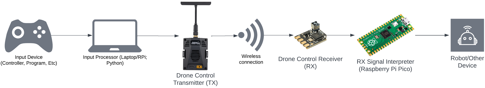
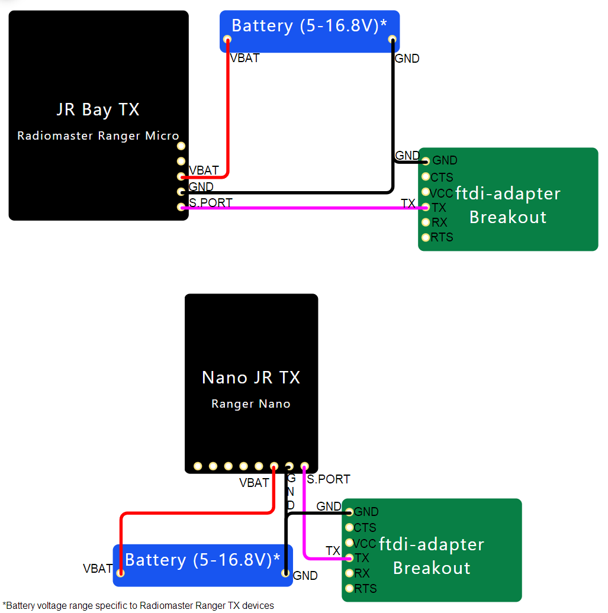
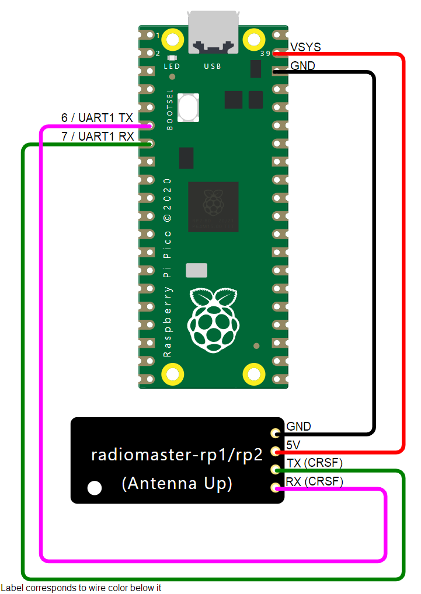
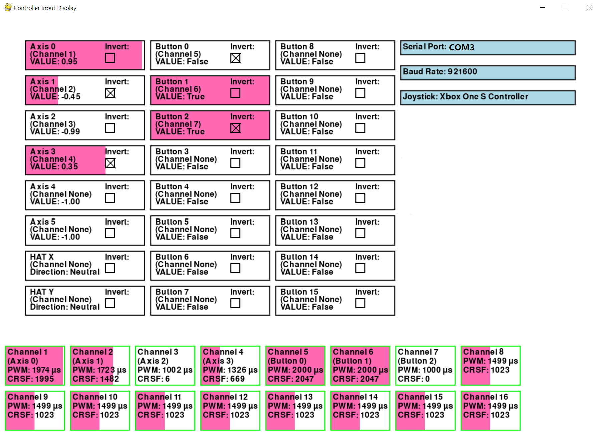

# Mini Rex Wireless Controls

Mini Rex -- Named after a breed of bunny rabbits. Designed for fast reproduction and flexibility. 

This is an overly-in-depth documentation for this project.

### Logan Gall -- (logangall.com)[https://logangall.com]

# Overview

Mini Rex is a hardware/software setup that allows for flexible, long-range, low-latency controller transmission.
This project is built off the [ExpressLRS](https://www.expresslrs.org/) (ELRS) and [Crossfire](https://www.team-blacksheep.com/media/files/tbs-crossfire-manual.pdf) (CRSF) Wireless control protocols, typically used to control FPV drones.
ELRS & CRSF have widespread adoption in the FPV drone community with an abundance of support, documentation, and budget-friendly hardware availability.
This project is yet another passion project with the goal to utilize and expand the use of these robust control systems.

## Flow Diagram



The primary goal of Mini Rex is to have an easily implementable solution to wirelessly transmit any input to any output device. This project is split into two parts, joined together by the ELRS/CRSF wireless transmission:

* **Input Side (TX)**:
   - Collects input from various devices like joysticks, game controllers, or sensors.
   - Converts this input into CRSF packets for transmission using ELRS.

* **Output Side (RX)**:
   - Receives CRSF packets wirelessly using an ELRS-compatible receiver.
   - Decodes the packets and maps the signals to control servos, motors, or other devices.

## Use Cases
* Standardized control interface for robotics projects. Use this rather than having to rely on WiFi, Bluetooth, IR, Gestures, AI, & Carrier Pigeons to make a robot move.
* Adaptable control inputs for an FPV drone. Another way to control drones rather than the 'traditional' transmitter radio.
* Hybrid control schemes. Utilize both user input and other local sensor data to control a device.
* Fully-autonomous controls. Program your favorite 'AI' to take over a robot.
* Ultra-long-range gamepads. Use your XBox controller to play video games from miles away.

# Implementation

Mini Rex uses a Python program to parse input from a Gamepad/Joystick input on a input processing computer.
This program sends CRSF signal data to a Drone Control Transmitter (TX) over serial.
The transmitter wirelessly sends data to the Drone Control Receiver (RX), which outputs the CRSF signal to a Raspberry Pi Pico.
The Pico runs a C++ program which interprets the data, outputting either an emulated Joystick signals to the final output device.

## Requirements

### Hardware

Following the flowchart above, this is a full list of hardware. 

**Note**: This project modular! Want to just control your drone programmatically? Drop the Raspberry Pi Pico and it should all work. Want to control a device with your drone controller? Drop the input processor. 

* **Input Device**
   * This can be an XBox controller, Program, or some other way of taking action.
   * This is required to display as if it were a Gamepad/Joystick/HID Device to the computer running the Python program.
* **Gamepad Input Processor**, aka a computer that can run Python 3.
   * This is required to have a USB or serial port available to communicate with the drone TX.
   * Main project development was done on a laptop running Windows 10, but also tested on a Raspberry Pi 4b.
* **Drone Control Transmitter Module (TX)**.
   * This can be any CRSF serial protocol based device (ELRS, TBS Crossfire, TBS Tracer).
   * Some ELRS TX are able to easily be connected via a USB cable.
   * Other devices may require a FTDI adapter and be connected via the S.PORT pin on the transmitter (similar to as if plugged into a standard drone transmitter)
   * Main project development was done using a Radiomaster Ranger Micro TX using both connection methods.
      * Untested on other devices, but likely to work.
* **Drone Control Receiver Chip (RX)**.
   * This can be basically any CRSF serial protocol based device compatible with your TX (ELRS EP1/EP2, TBS Crossfire Diversity RX, TBS Sixy9, etc.)
   * Main project development was done using a Radiomaster RP1 RX.
      * Untested on other devices, but extremely likely to work.
* **Drone Signal Interpreter**.
   * This is *tentatively* required to be a Raspberry Pi Pico (RP2040) device.
      * The rest of documentation assumes this device.
   * Other Arduino/C++ microcontrollers may be compatible, but not guaranteed.
* **Robot** or **Other End Device**.
   * Any object you want to control that can take either a simulated HID Gamepad input over USB (most computers) OR PWM wire signals.
   * Making the end device compatible is up to end user.

### Software

The input processor device requires most of the software, including device drivers and the ability to run Python.

* `Python 3.6` or higher
   * Package `pygame 2.6.0`
   * Package `pyserial 3.5`
   * Main project development was done in `Python 3.11.5`, other package versions may be compatible, but untested.
* Depending on connection to TX (explained later), these drivers are necesary:
   * [STM32 Virtual COM Port Driver](https://www.st.com/en/development-tools/stsw-stm32102.html). For connecting to TX over USB.
   * [FTDI Virtual Com Port Driver](https://ftdichip.com/drivers/) & [FT_PROG](https://ftdichip.com/utilities/#ft_prog). For connecting to TX using FTDI Adapter and S.PORT Pin.
   * Optional, but also useful: [Zadig](https://zadig.akeo.ie/). Used to fix driver issues per device.

The output Raspberry Pi Pico can be programmed using the Arduino IDE or PlatformIO
* When programming for the HID Gamepad output for the Pico, follow the requirements set by the mikeneiderhauser [CRSFJoystick](https://github.com/mikeneiderhauser/CRSFJoystick) repository.
   * This uses PlatformIO to send data to the Pico.
   * A **Note:** the Pico bootloaded often appears as a USB device when plugged in to a Windows 10 computer, I often had to use the following options in my `platformio.ini` file:
      ```
      platform = raspberrypi
      board = pico
      framework = arduino
      upload_protocol = uf2
      upload_port = D:\
      ```

# Wiring

## TX Side Wiring

The transmitter can be wired in two ways:
* Using a USB connection.
   * Easily compatible with ESP-32 based ELRS TX modules.
   * May require external power at high outputs (>100mw).
   * Requires minor modification to TX hardware settings.
* Using a FTDI serial adapter, plugged into the S.PORT pin on a TX module.
   * Compatible with all CRSF TX modules.
   * Likely to need external power, especially >25mw.
   * No changes to hardware settings.

**Note:** Please check out detailed wiring instructions in the Kaack [ELRS Joystick Control](https://github.com/kaack/elrs-joystick-control) repository, that information is basically being parroted here. 

### USB Connection

For this connection method, the [STM32 Virtual COM Port Drivers](https://www.st.com/en/development-tools/) are probably needed to be installed.

ExpressLRS TX Modules have a Web UI that is used to edit settings and other configuration. This is well documented in the [ExpressLRS Quick Start Guide](https://www.expresslrs.org/quick-start/getting-started/).

To make an ExpressLRS compatible over USB, we are changing the CRSF I/O pin from the module's S.BUS pin to the USB port. Go to the Web UI for the TX module, and go to the endpoint `/hardware.html`, by default this would be `10.0.0.1/hardware.html`.

At this endpoint, set the CRSF Serial Pins `RX pin` to `3` and `TX pin` to `1`.
* **Note:** Pins 3 and 1 are for nearly all ESP-32 based ELRS modules. The Kaack tutorial above also mentions to use the pins noted for `Backpack / Logging`, but that may or may not work for your TX. The Radiomaster Ranger Micro uses 3 and 1 for USB, while the Backpack / Logging section lists different pins.
* The CRSF pins will need to be reset to the original default if using device via the S.PORT again in the future.

After saving, the TX module should be ready to work over USB. A good way to check if it is working is the Fourflies [ELRS Buddy](https://github.com/Fourflies/elrsbuddy) website. This runs an ELRS configuration LUA script in a web browser, where you can also change power and transmission settings.

Should the TX Module need external power, it can be powered by the XT-30 plug (if available) or via the JR Bay power pins (shown in diagram in next section).

### FTDI Connection

For this connection method, the [FTDI Virtual Com Port Driver](https://ftdichip.com/drivers/) and the [FT_PROG tool](https://ftdichip.com/utilities/#ft_prog) are probably needed to be installed.

Follow the wiring diagrams below (depending on your module type) to hook up to the FTDI adapter. Have a common ground between all parts.
* **Note:** A battery is not required, but is highly recommended because most FTDI adapters can only output about 500ma current through VCC, causing higher-power TX modules to reboot. If you choose to not use a battery, plug in the VBAT on the JR Bay TX to the VCC on the FTDI adapter and connect grounds. **DO NOT CONNECT BOTH VCC OF THE ADAPTER AND VBAT OF THE BATTERY**

Next, plug in the FTDI adapter over USB to your computer. Using the FT_Prog tool set, the setting of the adapter to run Inverted Half-Duplext UART. Both RX and TX signals are inverted and travel over the TX wire. This should make the TX module ready to work using the FTDI adapter.




## RX Side Wiring

The second section of wiring is for the Raspberry Pi Pico device and the RX chip. This simply follows the wiring set out by the mikeneiderhauser [CRSFJoystick](https://github.com/mikeneiderhauser/CRSFJoystick) repository. Wire the CRSF pins to the UART TX and RX of the Pico, and supply power to the chip.



### PWM Output

If you would like PWM output for your device, at the moment, purchase a RX chip that is compatible with PWM out (Radiomaster ER8, Most TBS RX), or adapt the CapnBry [CRServoF](https://github.com/CapnBry/CRServoF) repository code to complete functionality with Raspberry Pi Pico. This is a future anticipated feature.


# Code

## TX Side

The Python transmission software can be run either as an interactive PyGame script, or as a headless terminal script.

### PyGame Script: `minirex_pygame.py`

This script serves as an interactive interface to map a controller to CRSF channels. On startup, a user can open a controller and serial device by clicking on the boxes for those devices. Then, the interactive interface shows live controller values and channel values. Clicking on a controller value allows it to be mapped to any corresponding CRSF channel. Inputs may also be checked to be inverted so they always work intuitively.

For regular use, the `controller_mapping.txt` file can be placed in the same directory as the PyGame script, and on startup will load the values given in the text file, auto-loading a controller configuration. This file is pre-filled with a default configuration.



### Headless Script: `minirex_headless.py`

This script is the exact same as the above interactive PyGame, but is designed to be run through terminal. This has no interactive elements and requires the loading of mappings and devices from the `controller_mapping.txt` file.

### **Protocol Note** 
Depending on how the channel configuration is set up in the Radio TX hardware, the final output device may display different CRSF values. TBS Crossfire systems typically send a full 16 channels, though ELRS is designed to be more efficient. So it may be set up differently, read [this ELRS documentation](https://www.expresslrs.org/software/switch-config/) for switch configurations.

## RX Side

The output of the Raspberry Pi Pico can be primarily run as an emulated gamepad.

### Emulated Gamepad

Follow the instructions from mikeneiderhauser [CRSFJoystick](https://github.com/mikeneiderhauser/CRSFJoystick) repository!

### PWM Output

See note above in the RX wiring section.

# Future Developments
This project still has plenty of ongoing development. This is my laundry list of things to continue development on:
* Ensure `controller_map.txt` file reads and loads seamlessly
* Address crashes to program
* Add any missing detail to documentation
* Implement telemetry functionality
* True PWM support

# Acknowledgements & References

This project builds off information from other great FPV coding projects, noted here and where relevant in documentation:

* CapnBry [CRServoF](https://github.com/CapnBry/CRServoF)
* [CRSF Working Group Specifications](https://github.com/crsf-wg/crsf)
* ELRS Community Discord
* [ExpressLRS Documentation](https://www.expresslrs.org/)
* Fourflies [ELRS Buddy](https://github.com/Fourflies/elrsbuddy)
* Kaack [ELRS Joystick Control](https://github.com/kaack/elrs-joystick-control)
* mikeneiderhauser [CRSFJoystick](https://github.com/mikeneiderhauser/CRSFJoystick)
* mstrens [oXs_on_RP2040](https://github.com/mstrens/oXs_on_RP2040)
* [Raspberry Pi Pico Documentation](https://www.raspberrypi.com/documentation/microcontrollers/)
* [TBS Crossfire Manual](https://www.team-blacksheep.com/media/files/tbs-crossfire-manual.pdf)
* ZZ-Cat [CRSF for Arduino](https://github.com/ZZ-Cat/CRSFforArduino)

This project was aided by the use of Generative AI (ChatGPT).
